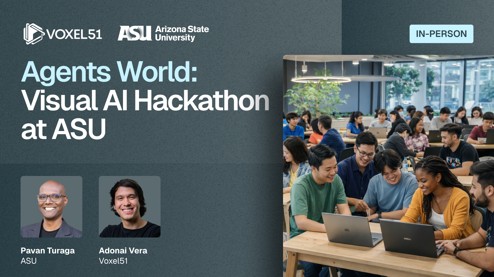
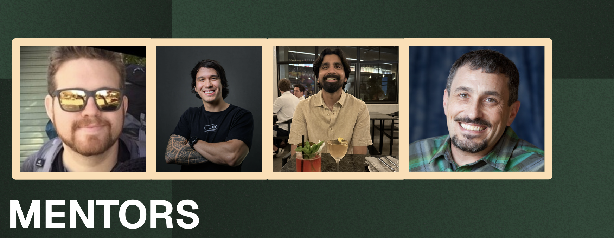

# Agents World: Visual AI Hackathon at ASU - March 21, 2026

Repo and Resources for the Agents World: Visual AI Hackathon at Arizona State University. If you haven't already, you can register [here](https://voxel51.com/events/agents-world-visual-ai-hackathon-at-asu-march-21-2026).



[](https://discord.com/invite/fiftyone-community)


## What This Hackathon Is About

Build autonomous vision agents that **see, reason, and act** using the [FiftyOne](https://docs.voxel51.com) open-source ecosystem.

With 100+ plugins for datasets, tools, and models, FiftyOne gives you everything you need to create practical Visual AI applications where agents analyze visual data, reason about it, and take action, all within hours.

#### Your job today

Each team selects **1-2 plugins** from the [FiftyOne plugin ecosystem](https://docs.voxel51.com/plugins/index.html). Your mission: **turn those plugins into a real, practical, innovative Visual AI application** with a clear use case.

You'll combine existing plugins with agents, MCP servers, and AI Skills to build something that works, something people can actually use.

*Bonus prize for teams that build their own FiftyOne plugin from scratch.*


## Schedule

| Time | Activity |
|---|---|
| 10:00 AM | Welcome |
| 10:15 AM | Introduction to the Hackathon |
| 10:30 AM | Find teammates & `pip install fiftyone` |
| 10:45 AM | Workshops: How to Build Plugins and How to Build with Agents / MCP & Skills |
| 11:30 AM | How ML teams use FiftyOne (speaker: Sid Mehta) |
| 12:00 PM | **Plugin Tracks** -- Define your use case |
| 12:30 PM | Lunch |
| 1:00 PM | How to Build with Gemini (speaker: Google Developer Expert Mike Wolfson) |
| 2:00 PM | Start hacking! |
| | *By ~2:30 PM* -- Plugin(s) selected, dataset loaded, first operator or agent call working |
| | *By ~3:30 PM* -- Core agent logic working (reasoning loop, tool calls, plugin integration) |
| | *By ~4:00 PM* -- Start polishing: handle edge cases, clean up UI, write README |
| 5:00 PM | **Final push to GitHub** -- judging begins |


## What Success Looks Like

You don't need to train a model.

You don't need a perfect system.

You need a **working Visual AI prototype** that demonstrates a thoughtful use of the FiftyOne plugin ecosystem to build an agent-powered application.

Concretely, a strong submission:

- **Solves a real problem.** It addresses a genuine challenge in visual AI. Whether that's automating data curation, building intelligent annotation workflows, multi-model reasoning pipelines, or something we haven't thought of.

- **Leverages the plugin ecosystem.** Pick 1-2 existing FiftyOne plugins and extend, combine, or enhance them into something greater than the sum of their parts.

- **Ships as a working demo.** At minimum: a GitHub repo with code, a README that explains what it does, and a short demo. Pushed to GitHub by 5 PM.

- **Could actually be used.** The best projects are ones a researcher or practitioner could install and get value from without writing code.

## Awards
Each category winner receives a $100 Amazon gift card.

| Award | What it means |
|---|---|
| **Grand Prize:  Overall Champion** | The best hack of the day: strong idea, solid execution, and a great demo. |
| **Most Innovative Hack** | A clever or unexpected approach that pushes vision + agents in a new direction. |
| **Most Impactful Hack** | The project with the biggest potential to matter in the real world. |
| **Most Creative Hack** | The wildest, weirdest, or most imaginative idea -- bonus points for originality. |
| **Least Useful (But Hilarious)** | Completely unnecessary. Absolutely ridiculous. Somehow impressive. |
| **Bonus: Build Your Own Plugin** | Special prize for teams that create their own FiftyOne plugin from scratch. |

### Presentations

Teams will:
1. Present their project to the judges (5 minutes)
2. Create slides that explain the inspiration or importance of the project (4-6 slides)
3. Show a demo of the application using the plugins


## Mentors

Need help? Stuck on a bug? Want to brainstorm ideas? Our mentors are here for you throughout the event.



Find us anytime during the hackathon, we'll help you debug, brainstorm, and ship.


## Microcredential

Participants who build a working Visual AI prototype and deliver a short demo using FiftyOne plugins earn the **Agentic AI Development Microcredential**, issued by **The GAME School at Arizona State University**.

### Full docs and troubleshooting

For the complete installation guide, see the [FiftyOne installation docs](https://docs.voxel51.com/installation/index.html#fiftyone-installation).

If you run into any issues, just ask one of us. We'll get you sorted out.


## FiftyOne Crash Course

The full FiftyOne docs are at [docs.voxel51.com](https://docs.voxel51.com).

The [User Guide](https://docs.voxel51.com/user_guide/index.html) and [Plugins Guide](https://docs.voxel51.com/plugins/index.html) are particularly relevant for today.

For a hands-on walkthrough of using Claude to build FiftyOne plugins from scratch, check out the [Vibe Coding Production-Ready CV Pipelines workshop recording](https://voxel51.com/events/vibe-coding-production-ready-computer-vision-pipelines-hands-on-workshop-march-18-2026).


## The Plugin Ecosystem

The FiftyOne plugin ecosystem has **100+ plugins** for datasets, tools, and models. Browse the full list in the [Plugin Gallery](https://docs.voxel51.com/plugins/index.html#).

### Using Plugins

```bash
# Download plugin(s) from a GitHub repository
fiftyone plugins download https://github.com/<user>/<repo>[/tree/branch]

# Download specific plugins from a GitHub repository
fiftyone plugins download \
    https://github.com/<user>/<repo>[/tree/branch] \
    --plugin-names <name1> <name2> <name3>
```

### Starter Templates

These repos from the [FiftyOne Plugins repository](https://github.com/voxel51/fiftyone-plugins) contain working examples you can reference (and steal from):

[](https://github.com/voxel51/fiftyone-plugins/tree/main/plugins/hello-world) -- Minimal example with Python + JS components. Start here if you're building your first plugin.

[](https://github.com/voxel51/fiftyone-plugins/tree/main/plugins/operator-examples) -- 25 operators demonstrating the full type system: buttons, forms, progress bars, file uploads, tables, plots, delegated execution, secrets, and more.

[](https://github.com/voxel51/fiftyone-plugins/tree/main/plugins/panel-examples) -- Panels that render custom UI (Plotly charts, dashboards, media players, etc.)

[](https://github.com/voxel51/fiftyone-plugins/tree/main/plugins/metric-examples) -- Custom evaluation metrics


### Featured Plugin Examples

These are real community plugins that showcase what's possible, and great starting points for your hackathon project:

| Preview | Plugin | Description |
|---|---|---|
|  | [](https://github.com/AdonaiVera/gemini-vision-plugin) | Google's multimodal model that understands images and videos, enabling advanced visual reasoning, description, and analysis. |
|  | [](https://github.com/harpreetsahota204/qwen3vl_video) | A powerful vision-language model optimized for video understanding, capable of reasoning over frames, describing actions, and analyzing long visual sequences. |
|  | [](https://github.com/harpreetsahota204/moondream3) | A compact vision-language model designed for fast, efficient image understanding, offering strong captioning and visual reasoning while staying lightweight. |
|  | [](https://github.com/harpreetsahota204/olmOCR-2) | A fast, lightweight OCR model that extracts text accurately from images, even with small or low-quality text. |
|  | [](https://github.com/AdonaiVera/fiftyone-agents) | Tests multiple VLMs with dynamic prompts against datasets -- demonstrates the agent-over-models pattern. |


## Building with Agents, MCP & Skills

This hackathon is about building with **autonomous vision agents**, systems that can see, reason, and act on visual data.

### What are Agents?

An agent is a system that uses AI models as its reasoning engine to decide what actions to take. In the context of Visual AI, agents can:
- Decide which images/videos to analyze
- Choose which models or plugins to invoke
- Interpret results and take follow-up actions
- Orchestrate multi-step visual AI workflows

### MCP (Model Context Protocol)

MCP lets AI assistants interact with FiftyOne directly. Your agent can use MCP to load datasets, run operators, query samples, and more, all through a standardized protocol.

### FiftyOne Skills

Skills are prompt-ready files that give AI assistants deep context on FiftyOne's codebase. Use them to supercharge your AI coding tools.

[](https://github.com/voxel51/fiftyone-skills) Prompt-ready skill files for AI assistants

The [](https://github.com/voxel51/fiftyone-skills/tree/main/skills/fiftyone-develop-plugin) skill is particularly useful, it teaches your AI assistant the plugin development patterns, file structure, and API conventions.

### Building with Gemini

Google Developer Expert **Mike Wolfson** will present on building with Gemini at 1:00 PM. Gemini's multimodal capabilities make it a powerful backbone for visual AI agents, use it for image understanding, video analysis, and multi-turn visual reasoning.


## Use AI to speed up development

You're encouraged to use AI coding tools. This is a hackathon, not a purity test. We have resources specifically for this:

[](https://github.com/voxel51/fiftyone-skills) Prompt-ready skill files that give AI assistants deep context on FiftyOne's codebase.

For a hands-on walkthrough of using Claude to build FiftyOne plugins from scratch, check out the [Vibe Coding Production-Ready CV Pipelines workshop recording](https://voxel51.com/events/vibe-coding-production-ready-computer-vision-pipelines-hands-on-workshop-march-18-2026).

## Datasets for Inspiration

Need a dataset to build your agent on? Voxel51 hosts **145+ ready-to-use datasets** on Hugging Face that load directly into FiftyOne.

Browse them all: [huggingface.co/Voxel51/datasets](https://huggingface.co/Voxel51/datasets)

Here are some highlights to get you started:

| Preview | Dataset | Description |
|---|---|---|
|  | [](https://huggingface.co/datasets/Voxel51/olmOCR_bench) | OCR benchmark images with text. Great for Document Intelligence agents. |
|  | [](https://huggingface.co/datasets/Voxel51/spatial_lm_dataset) | Spatial language model data. Great for Spatial reasoning agents. |
|  | [](https://huggingface.co/datasets/Voxel51/retail_gaze) | Retail eye-tracking / gaze data. Great for Retail analytics agents. |
|  | [](https://huggingface.co/datasets/Voxel51/MERL_Shopping_Dataset) | Shopping behavior dataset. Great for Action recognition agents. |
|  | [](https://huggingface.co/datasets/Voxel51/egocart_videos) | Egocentric shopping cart videos. Great for Video understanding agents. |
|  | [](https://huggingface.co/datasets/Voxel51/segment_anything_video_subset51) | SAM video segmentation subset. Great for Segmentation agents. |
|  | [](https://huggingface.co/datasets/Voxel51/maptrace_20k) | 20k map tracing images. Great for Geospatial agents. |
|  | [](https://huggingface.co/datasets/Voxel51/crops3d) | 3D crop data. Great for Agriculture / 3D agents. |

### Loading Hugging Face Datasets into FiftyOne

```python
import fiftyone as fo
import fiftyone.utils.huggingface as fouh

# Load any Voxel51 dataset from Hugging Face
dataset = fouh.load_from_hub("Voxel51/<dataset-name>")

# Launch the App to explore
session = fo.launch_app(dataset)
```

You can also use any dataset from the [FiftyOne Zoo](https://docs.voxel51.com/user_guide/dataset_zoo/index.html) (COCO, Open Images, CIFAR, etc.):

```python
import fiftyone.zoo as foz

dataset = foz.load_zoo_dataset("coco-2017", split="validation", max_samples=1000)
```


# Plugin Ideas

These are starting points, not assignments. Mix, remix, or ignore them entirely.

The best hackathon projects are the ones that solve a problem *you* care about.

---

### Smart Data Curator Agent

**Problem:** You have a large dataset and need to find the most valuable samples for a specific task, but manually browsing thousands of images is impractical.

**Approach:** Build an agent that uses FiftyOne Brain embeddings to analyze your dataset, automatically clusters samples, identifies outliers and edge cases, and recommends a curated subset. The agent reasons about which samples are most representative, most unique, or most likely to improve model performance.

**Plugins to start with:** `@voxel51/brain`, `@voxel51/zoo`

---

### Multi-Model Visual QA Agent

**Problem:** Different vision-language models have different strengths. You want an agent that can route visual questions to the best model and synthesize answers.

**Approach:** Combine multiple VLM plugins (Gemini Vision, Moondream3, Qwen3-VL) into an agent that accepts a visual question, decides which model(s) to query based on the question type, runs inference, and compares/synthesizes the results. Display a comparison panel in the FiftyOne App.

**Plugins to start with:** `@AdonaiVera/gemini-vision-plugin`, `@harpreetsahota/moondream3-fiftyone`, `@harpreetsahota/qwen3-vl-video`

---

### Automated Annotation Agent

**Problem:** You have thousands of unlabeled images and need annotations fast. Manual labeling is too slow.

**Approach:** Build an agent that loops through unlabeled samples, runs a VLM to generate descriptions and labels, uses zero-shot classification to assign categories, and writes the results back as FiftyOne labels. Add a confidence threshold -- samples below the threshold get flagged for human review.

**Plugins to start with:** Any VLM plugin + `@voxel51/annotation`

---

### Document Intelligence Agent

**Problem:** You have a dataset of document images (receipts, forms, signs) and need to extract, categorize, and search structured information.

**Approach:** Use olmOCR-2 to extract text from images, then pipe the extracted text through a language model to categorize documents, extract key fields, and build a searchable index. Create a panel that lets users search documents by content.

**Plugins to start with:** `@harpreetsahota/olmocr-fiftyone`, `@AdonaiVera/gemini-vision-plugin`

---

### Embedding-Powered Anomaly Detector

**Problem:** You have a dataset of "normal" images and need to flag unusual or defective samples without labeled examples of anomalies.

**Approach:** Compute embeddings for all samples using FiftyOne Brain. Build a baseline distribution from known-good samples. The agent flags samples whose embeddings are far from the baseline (by cosine distance or z-score), visualizes them in an embedding plot, and generates natural-language explanations of why each sample is anomalous using a VLM.

**Plugins to start with:** `@voxel51/brain`, any VLM plugin

---

### Visual Search & Retrieval Agent

**Problem:** You want to find specific images in a large dataset using natural language, but standard keyword search doesn't work for visual content.

**Approach:** Build an agent that accepts natural language queries, computes multimodal embeddings, retrieves the most relevant samples, and can refine searches iteratively based on user feedback. Add a conversational interface where users can say "show me more like this" or "but with outdoor lighting."

**Plugins to start with:** `@voxel51/brain`, `@voxel51/voxelgpt`

---

### General Tips

- **Start small.** Get a single operator or agent call working on 5 samples before scaling up.
- **Pick your plugins first.** Browse the [plugin gallery](https://docs.voxel51.com/plugins/index.html#) and pick 1-2 that excite you. Everything else flows from there.
- **A working demo beats a perfect architecture.** Ship something early, polish after.
- **Use the mentors.** We're here to help you debug, brainstorm, and unblock.
- **Have fun.** The "Least Useful (But Hilarious)" prize exists for a reason.
